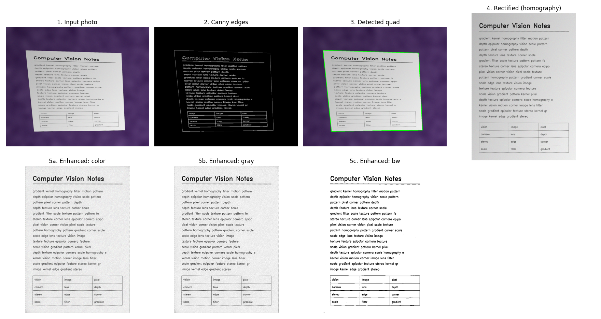
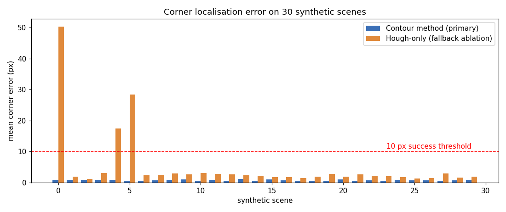

# Document Scanner & Enhancer (`docscan`)

A command-line **document scanner built with classical computer vision**. Give it a photo of
a page taken at an angle; it finds the page, flattens the perspective and cleans up the
lighting - the same idea as a phone "scan" app, but every step is implemented in plain,
readable Python so you can study how it works.

> Reference sample project for the *Computer Vision* course (VITyarthi "Build Your Own
> Project"). It demonstrates the expected repository structure, documentation, testing and
> report. Students must create their **own** original project.

## Overview
```
photo -> validate -> edges (Canny) -> page quad (contours | Hough fallback)
      -> homography (DLT) -> perspective warp -> enhance -> save + metrics
```



## Features
- **Module 1 - Detection:** Gaussian filtering, Otsu-driven Canny edges, contour-based quad
  finding, Hough-transform fallback gated by edge support.
- **Module 2 - Rectification:** normalised **DLT homography written from scratch** (SVD),
  perspective warp, optional A4/Letter aspect prior.
- **Module 3 - Enhancement:** flat-field illumination correction, **histogram equalisation
  from scratch**, CLAHE, unsharp masking, adaptive thresholding (`color` / `gray` / `bw`).
- Single image, batch folder, synthetic demo and accuracy-evaluation commands.
- Quality metrics (sharpness, contrast, entropy) and ground-truth corner error.
- Validated config, clear error messages, non-zero exit codes, console + file logging.

## Technologies
Python 3.9+, NumPy, OpenCV (`opencv-python-headless`), `unittest` (standard library).
Optional for regenerating diagrams/figures: Matplotlib.

## Project Structure
```
doc-scanner-cv/
|-- main.py                 # CLI entry point (scan | batch | demo | evaluate)
|-- docscan/
|   |-- config.py           # validated ScanConfig dataclass
|   |-- logger.py           # console + file logging
|   |-- io_utils.py         # load/save + input validation
|   |-- preprocess.py       # grayscale, blur, histogram equalisation (scratch)
|   |-- edges.py            # Canny + Hough line detection
|   |-- detect.py           # page-quad detection (contour + Hough fallback)
|   |-- geometry.py         # DLT homography (scratch), rectification
|   |-- enhance.py          # illumination fix, CLAHE, sharpen, threshold
|   |-- metrics.py          # sharpness / contrast / entropy / corner error
|   |-- pipeline.py         # ScanPipeline orchestrator
|   |-- synthetic.py        # synthetic scenes with ground-truth corners
|   `-- evaluate.py         # batch evaluation + ablation
|-- tests/                  # 40 unit + integration tests
|-- scripts/                # make_diagrams.py, make_figures.py
|-- docs/                   # diagrams, figures, evaluation results
|-- samples/                # example input/output images
|-- statement.md            # problem statement
`-- requirements.txt
```

## Installation
Works on Windows, macOS and Linux from a terminal. No GUI is required.

```bash
# 1. Clone
git clone https://github.com/<your-username>/doc-scanner-cv.git
cd doc-scanner-cv

# 2. (Recommended) create a virtual environment
python -m venv .venv
source .venv/bin/activate          # Windows: .venv\Scripts\activate

# 3. Install dependencies
pip install -r requirements.txt
```

## Usage
```bash
# Try it immediately - generates a synthetic photo, then scans it (saves debug images)
python main.py demo -o outputs/demo

# Scan one photo (modes: color | gray | bw ; paper: auto | a4 | letter)
python main.py scan path/to/photo.jpg -o outputs/scan --mode bw --paper a4 --debug

# Scan every image in a folder (bad files are skipped and reported)
python main.py batch path/to/photos/ -o outputs/batch

# Measure accuracy on 30 synthetic scenes with known ground truth
python main.py evaluate -n 30 -o outputs/eval

# Help
python main.py --help
python main.py scan --help
```
Results are written to the chosen output folder; logs go to `logs/docscan.log`
(`-v` enables debug logging). Exit codes: `0` success, `1` error, `2` batch finished with skipped files.

## Testing
```bash
python -m unittest discover -s tests -t . -v
```
The 40 tests cover: DLT correctness (exact mapping, agreement with OpenCV, noise
robustness, degenerate input), point ordering, histogram equalisation, illumination
correction, detection accuracy, the Hough fallback and its rejection gate, all enhancement
modes, config/IO validation, and end-to-end CLI behaviour (including error exit codes).

## Results
Evaluated on 30 synthetic scenes (random perspective, lighting gradient, sensor noise):

| Metric | Value |
|--------|-------|
| Detection success (corner error <= 10 px) | 100 % |
| Mean / max corner error | 0.73 px / 1.13 px |
| Hough-only fallback success (ablation) | 90 % |



**Honest limitations:** synthetic scenes are cleaner than real photos, so real-world
accuracy will be lower; a single image cannot reveal a page's true aspect ratio without
camera intrinsics (hence the `--paper` prior); curved or heavily occluded pages are not handled.

## Documentation
- [`statement.md`](statement.md) - problem statement, scope, users, features
- [`docs/Project_Report.pdf`](docs/Project_Report.pdf) - full project report (sample)
- `docs/diagrams/` - architecture, workflow, use-case, sequence, class/component diagrams
- `docs/figures/`, `docs/evaluation/` - result figures and per-scene CSV

## Regenerating diagrams and figures (optional)
```bash
pip install matplotlib
python scripts/make_diagrams.py
python scripts/make_figures.py
```

## License
Educational use.
